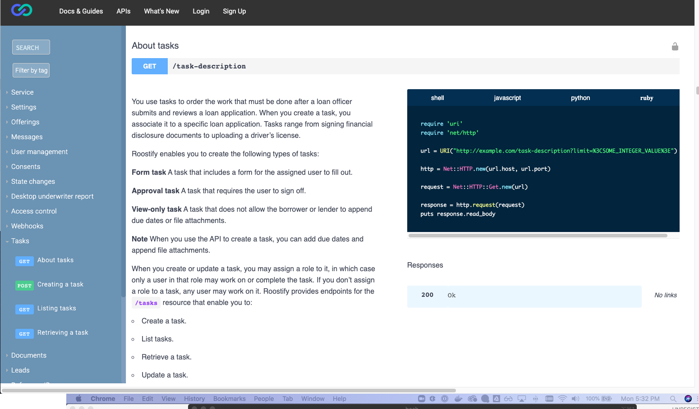
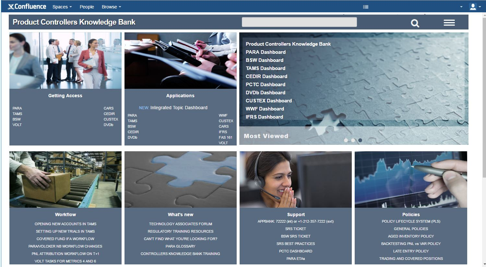
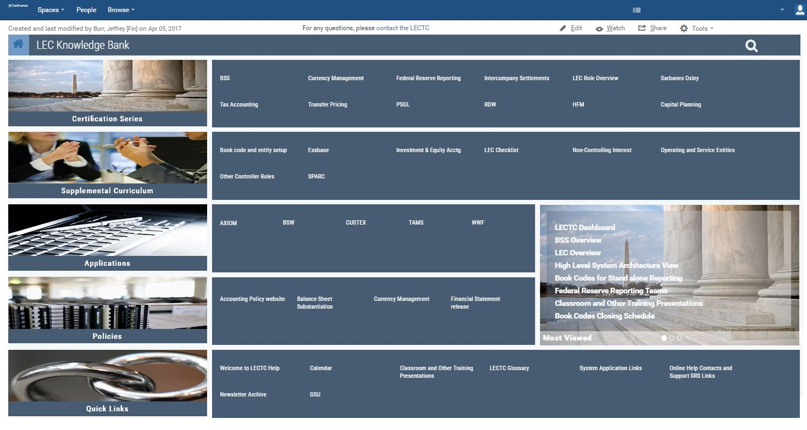

# Jeffrey Burr Work Samples

## Infocenters

For a full IBM Infocenter sample click [here](http://jeffreyburr.org/IBM/Elixir_Only/en-US/Content/Visualization/Documentation/Flex/Elixir_Enterprise/_pubskel/).

 

For a VMWare Infocenter (PDF version) click [here](https://github.com/jeofree/samples/blob/master/vfabric-gemfire-ug-6.6.4.pdf).

  
  

## API Documentation

For a recent OpenAPI 3.0 (Formerly Swagger 2.0) Spec and Documentation:

1. Right-click [here](roostify-core-api.html) and select "Save link as..." to download the html file.
2. Open the downloaded file with Chrome or another browser.

 
 
 _A screenshot of the documentation above as published in a Kong API Gateway_

  
  
## UIs
Goldman Sachs Confluence Knowledge Bank Interface

 

Goldman Sachs Legal Entity Controllers Interface

