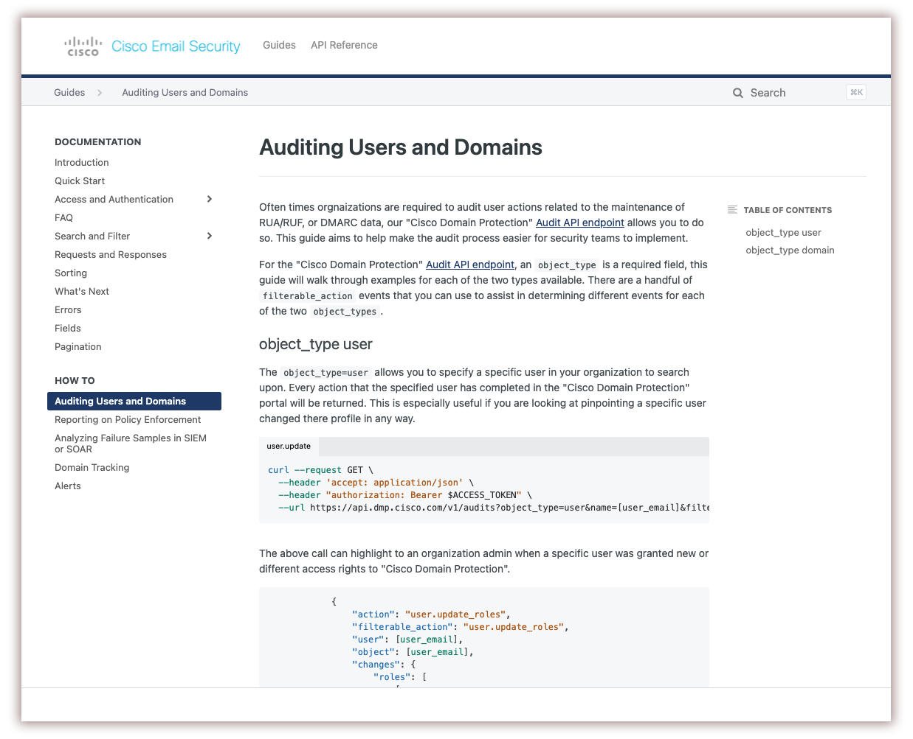
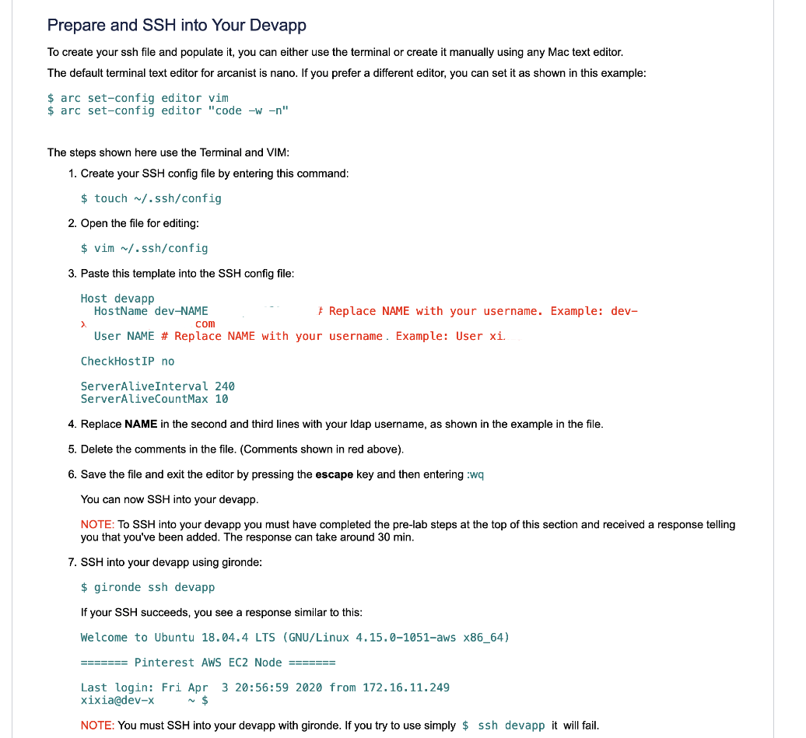
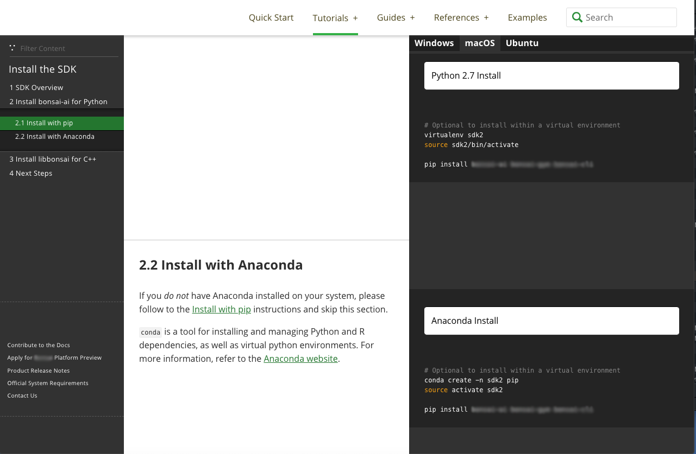
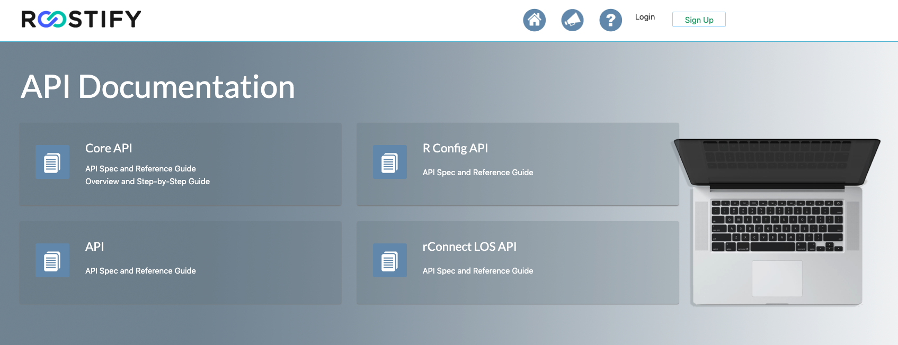
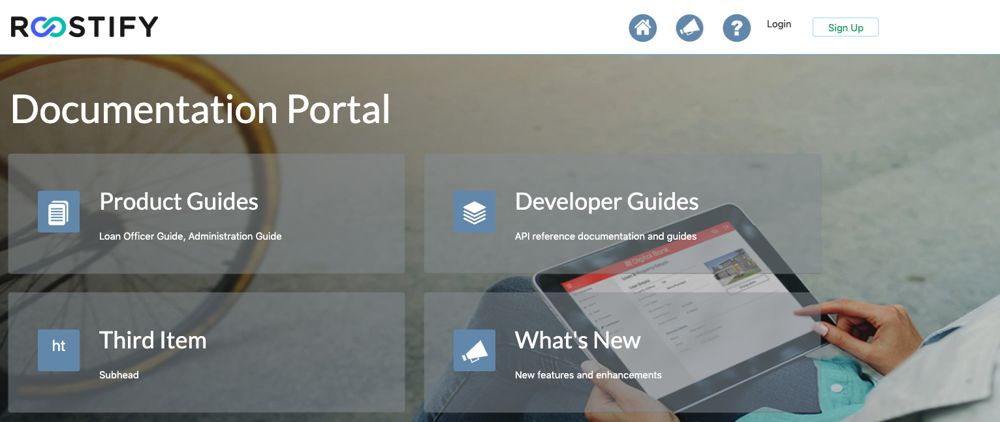
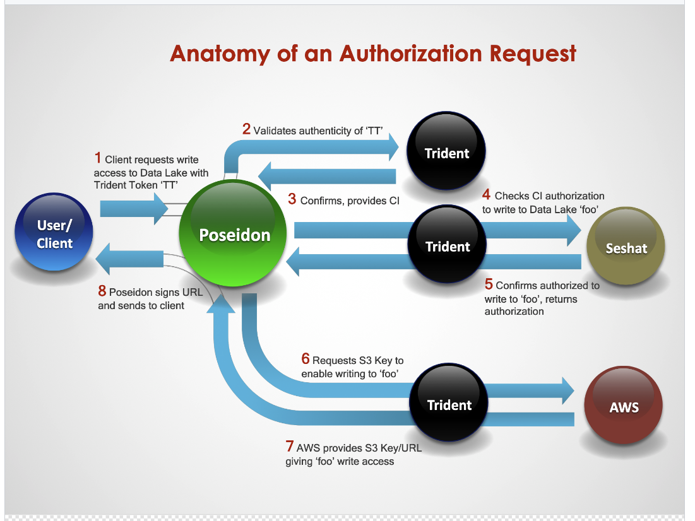

# Jeffrey Burr Work Examples

This portfolio contains a sampling of documentation, user interfaces, and graphics that I've created for clients and employers.

## API Documentation

Expertise with OpenAPI 3.0, Swagger 2.0 (and the difference between them).

A recent documentation sample from my current work:

## Pinterest Developer New Hire Guide

I created this in Confluence. This is a PDF export of one part of a topic, with a few details redacted.

## Infocenters

This represents the kind of documentation I wrote in my earliest technical writing experiences at Alcatel and IBM. This typically meant working on a team of half a dozen writers, learning how to write using DITA and various XML editors like Epic Editor, Oxygen XML, and IBM's in-house Information Developers Workbench (IDWB) which was actually the precusor to the DITA-OT. 

 

For a VMWare Infocenter (PDF version) click [here](https://github.com/jeofree/samples/blob/master/vfabric-gemfire-ug-6.6.4.pdf).

  

## Installation Guide

_A screenshot of an installation guide written and published using Slate and Python/Sphinx_

  
## UIs
Goldman Sachs Confluence Knowledge Bank Interface

 

Goldman Sachs Legal Entity Controllers Interface

  
API Documentation Interface

  
Product Documentation Interface

## Graphics

## Interactive Graphics

[Machine Learning Platform](http://jeffreyburr.org/Sony/Machine_Learning_Scroll_Sample.html)

[Neural Network Activation Layer Types](http://jeffreyburr.org/Sony/ML_NN_Scroll/Machine_Learning_NN_Scroll.html)

