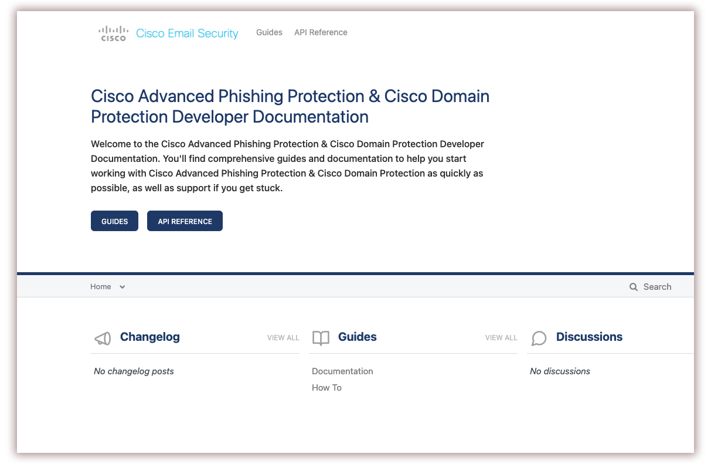

# Jeffrey Burr Work Examples

This portfolio contains a sampling of documentation, user interfaces, and graphics that I've created for clients and employers.

## API/Developer Documentation

Current work:

https://docs.branchapp.com/branch-developer/reference/intro/getting-started

A recent documentation sample:

I've created multiple API documentation portals using ReadMe.io over the past several years, some of which are showcased on ReadMe's [Customer Showcase page](https://readme.com/customers) (scroll down to "Agari").

[Cisco API Portal](https://apidoc.appc.cisco.com/reference/overview)

[My most recent ReadMe.io site](https://docs.sezzle.com/sezzle-integration/docs), just launched.

## Pinterest Developer New Hire Guide

I created this in Confluence. This is a PDF export of one part of a topic, with a few details redacted.

## Infocenters

This represents the kind of documentation I wrote in my earliest technical writing experiences at Alcatel and IBM. This typically meant working on a team of half a dozen writers, learning how to write using DITA and various XML editors like Epic Editor, Oxygen XML, and IBM's in-house Information Developers Workbench (IDWB) which was actually the precusor to the DITA-OT. 

 

  

## Installation Guide

_A screenshot of an installation guide written and published using Slate and Python/Sphinx_

  
## UIs
Goldman Sachs Confluence Knowledge Bank Interface

 

Goldman Sachs Legal Entity Controllers Interface

  
API Documentation Interface

  
Product Documentation Interface

## Graphics

## Interactive Graphics

### Sony Playstation Machine Learning

[Machine Learning Platform](http://jeffreyburr.org/Sony/Machine_Learning_Scroll_Sample.html)

[Neural Network Activation Layer Types](http://jeffreyburr.org/Sony/ML_NN_Scroll/Machine_Learning_NN_Scroll.html)

